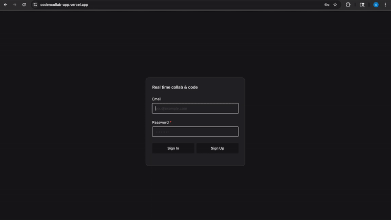
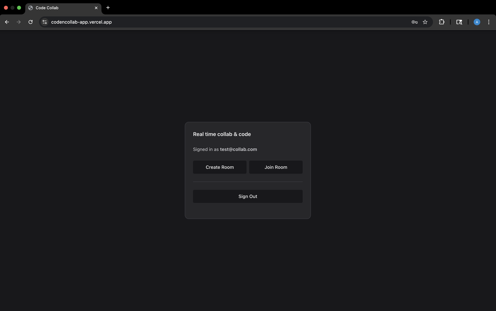
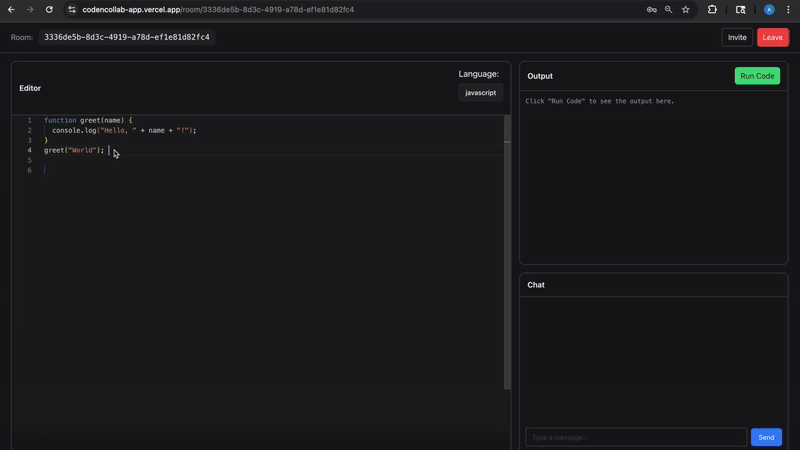
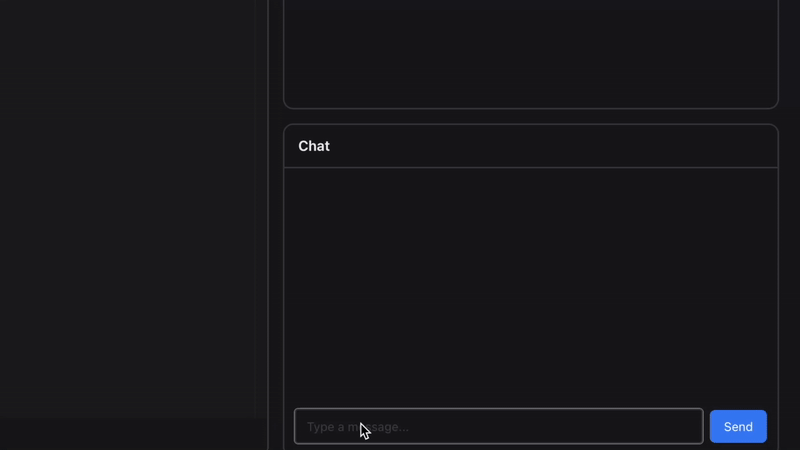
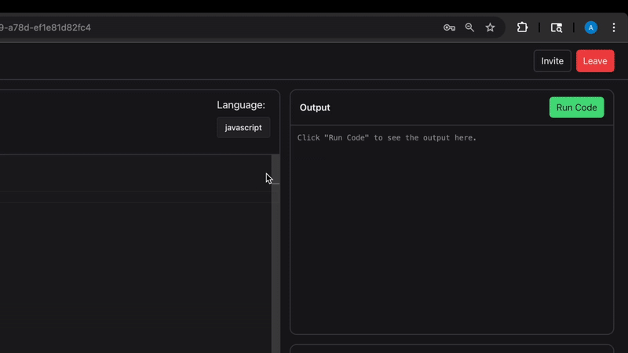

# CodenCollab


A high-performance, real-time collaborative code editor built for technical interviews and pair programming. CodenCollab combines the **Monaco Editor** (VS Code's editor engine) with low-latency **WebSocket** synchronization, in-room chat, and code execution in a self-hosted Docker sandbox.

---

## Table of Contents
- [Live Demo](#live-demo)
- [Screenshots](#screenshots)
- [Features](#features)
- [Project Structure](#project-structure)
- [Tech Stack](#tech-stack)
- [Code Execution](#code-execution)
- [Installation](#installation)
- [Environment Variables](#environment-variables)
- [Usage](#usage)
- [Testing](#testing)
- [Deployment](#deployment)
- [Roadmap](#roadmap)
- [License](#license)

---

## Live Demo

**Application:** https://codencollab-app.vercel.app

---

## Screenshots

### Authentication


### Home / Lobby


### Collaboration Room


### Live Chat


### Code Execution Output


---

## Features

- **Real-time Synchronization:** Low-latency collaborative editing using Socket.IO
- **Live Cursor Tracking:** Color-coded cursors show where teammates are typing
- **Sandboxed Code Execution:** Python, JavaScript, TypeScript, PHP, and Java run in disposable, network-isolated Docker containers with memory/CPU/process limits — no third-party execution API required
- **Integrated Chat:** Communicate instantly within each collaboration room
- **Authenticated Everywhere:** Every REST endpoint and the WebSocket handshake itself require a valid Supabase JWT, and joining a room requires being its creator or an existing member

---

## Project Structure

```bash
code-collab/
├── backend/
│   ├── app/
│   │   ├── main.py            # FastAPI + Socket.IO entry point
│   │   └── sandbox.py         # Docker-based code execution sandbox
│   ├── docker/
│   │   └── typescript.Dockerfile  # Custom image (ts-node preinstalled)
│   ├── tests/                 # pytest suite (auth + room membership)
│   ├── pytest.ini
│   ├── .env                   # Backend environment variables
│   └── requirements.txt       # Python dependencies
│
├── adversarial-tests/          # Manual containment tests run against the sandbox
│   ├── attacks/                # One malicious program per attack
│   ├── run_attacks.py
│   └── README.md
│
├── frontend/
│   ├── src/
│   │   ├── pages/
│   │   │   ├── components/
│   │   │   │   ├── Chat.tsx              # Real-time chat component
│   │   │   │   ├── LanguageSelector.tsx  # Language selection dropdown
│   │   │   │   └── OutPut.tsx            # Code execution output display
│   │   │   ├── Home.tsx                  # Landing page
│   │   │   └── Room.tsx                  # Collaboration room
│   │   ├── supabaseClient.ts             # Supabase configuration
│   │   ├── App.tsx
│   │   └── main.tsx
│   │
│   ├── .env                 # Frontend environment variables
│   └── vite.config.ts       # Vite configuration
│
│
│
├── .env.example    # Environment variable template
│
├── LICENSE
│
├── assets/
│
└── README.md
```

---

## Tech Stack

| Layer    | Technology              | Purpose                                          |
| -------- | ----------------------- | ------------------------------------------------ |
| Frontend | React 18, Monaco Editor | Editor UI, local state, real-time events         |
| Backend  | FastAPI, Socket.IO      | Room orchestration, auth validation, event relay |
| Services | Supabase, Docker (via `docker-py`) | Authentication, isolated code execution |
| Hosting  | Vercel, Railway         | Frontend and backend deployment                  |

---

## Code Execution

Code entered in a room is run in its own disposable Docker container (`backend/app/sandbox.py`), not sent to a third-party execution API. Each run:

- has **no network access** (`--network none`)
- is capped on **memory, CPU, and process count**, with a hard **wall-clock timeout** and an **output size cap**
- runs as a **non-root user** with **every Linux capability dropped** and a **read-only root filesystem**

Supported languages: **Python, JavaScript, TypeScript, PHP, Java**. TypeScript and Java involve a compile step; C# is not yet wired up and is rejected with an explicit "unsupported language" error rather than silently mishandled.

A previous version of this project used [Piston](https://github.com/engineer-man/piston) for execution. Piston's public instance was locked down in Feb 2026, so it's kept only as a disabled fallback behind a `USE_PISTON` environment variable (default `false`) in case a hosted key ever becomes available again.

---

## Installation

### Prerequisites

* Node.js 18+
* Python 3.10+
* Docker (Docker Desktop or another local daemon) — required for code execution
* Supabase project (URL + anon key)

### 1. Clone Repository

```bash
git clone https://github.com/ALTM005/code-collab.git
cd code-collab
```

### 2. Backend Setup

```bash
cd backend
python -m venv venv
source venv/bin/activate   # Windows: venv\Scripts\activate
pip install -r requirements.txt
```

### 3. Frontend Setup

```bash
cd ../frontend
npm install
```

---

## Environment Variables

Create a `.env` file in **both** directories.

### Frontend (`frontend/.env`)

```env
VITE_API_URL=http://localhost:8000
VITE_SUPABASE_URL=
VITE_SUPABASE_ANON_KEY =
```

### Backend (`backend/.env`)

```env
FRONTEND_ORIGIN =http://localhost:5173
SUPABASE_URL =
SUPABASE_SERVICE_ROLE =
SUPABASE_JWT_SECRET =
PISTON_API =https://emkc.org/api/v2/piston/execute
USE_PISTON =false
```

`PISTON_API` is still validated as present at startup even though it isn't called by default — the code execution path is Docker-based now (see [Code Execution](#code-execution)); leave `USE_PISTON` unset or `false` unless you specifically want the disabled Piston fallback.

---

## Usage

### 1. Start Backend

```bash
# inside /backend (ensure venv is active, and Docker is running)
uvicorn app.main:asgi --reload
```

### 2. Start Frontend

```bash
# inside /frontend
npm run dev
```

### 3. Collaborate

* Open the URL shown by Vite (usually `http://localhost:5173`)
* Create a room and copy the **Room ID**
* Share the Room ID to collaborate in the same session

---

## Testing

### Backend unit tests

```bash
cd backend
.venv/bin/python -m pytest tests/ -v
```

Covers socket-connect token verification and room-join membership authorization.

### Sandbox containment tests

```bash
cd backend
.venv/bin/python ../adversarial-tests/run_attacks.py
```

Runs 11 malicious programs (fork bomb, memory exhaustion, disk fill, network access attempts, privilege escalation, and more) through the real sandbox and confirms each is actually contained — see `adversarial-tests/README.md` for the full list. **Never run the files under `adversarial-tests/attacks/` directly** — several of them will do to your machine exactly what they're supposed to fail to do inside the sandbox.

---

## Deployment

* **Frontend:** Deployed on Vercel with environment variables configured in the dashboard
* **Backend:** Deployed on Railway with build command `pip install -r requirements.txt`
* WebSocket and REST communication handled between frontend and backend
* Supabase JWTs are validated server-side for protected actions, and on the WebSocket handshake itself
* The code-execution sandbox needs a real Docker daemon reachable from wherever the backend runs — this has not been verified on Railway's standard hosting, which may not expose one by default

---

## Roadmap

* Presence indicators for active users
* Persistent room state and history
* Role-based permissions (editor / viewer)
* Multi-file support per collaboration room
* C# execution support in the sandbox
* Redis-backed Socket.IO adapter for running more than one backend instance

---

## License

MIT License
